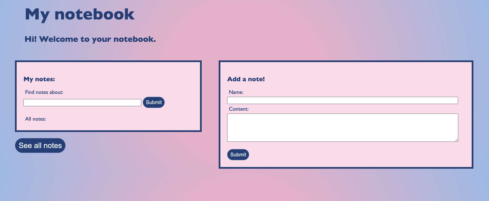
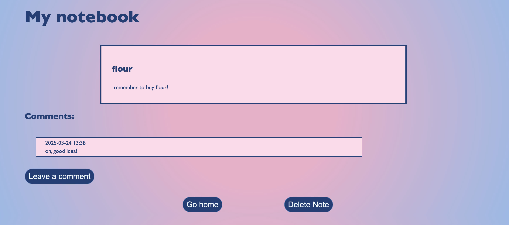

## A simple notekingtaking app

### About
Welcome to My Notebook! This is a simple way to make and store notes in a single place. There are three primary ways that you can interact with My Notebook:
- Viewing a list of all notes in the notebook
- Searching for notes that contain some term in their content
- Adding a note to the notebook

### Getting started
To activate My Notebook, first clone this repository. 

Then, we'll use Docker to build a container for the app. To build the image for this app, navigate to where this repository is stored using your terminal, and run:
```
docker build -t notebook .
```

Then, boot up the app by running the image. In your terminal, run:
```
docker run -p 5000:5000 --rm notebook
```

From there, you should be able to point your browser to http://127.0.0.1:5000 to open the notetaking app. 

Note that if you use the above `docker` command to boot up the app, the container created to run the app will be deleted as soon as you quit. 

### Adding a note

On startup, you'll be greeted with an empty list on the left, and a form titled **Add a note!** on the right. 

To add a note, simply type the name of the note, add some text to the content, and then click submit! The name of your note should appear in the list on the left. 

### Adding a comment

You can a comment to existing notes. Click the note's name in the list on the left-hand side of the homescreen, and it will bring you to page for that note. You can click the button `Leave a comment` to reveal the comment submission form. 

Simply enter your comment into the submission form, and click the `Submit` button. The comment should appear beneath the note, with the date and time that it was submitted. 

### Deleting a note
Enter a note's page from the list on the home screen, and click the `Delete Note` button. 

You will then be redirected to the home screen, where you can observe that the deleted note is no longer located in the list.

### Searching the notebook
You can use the form on the left-hand side of the home screen to search the notes. This fetaure allows you to search the name and content of notes for a keyword, in addition to their comments. 

Any note for which the keyword can be found in its name, content, or comments will be included in your search results. 